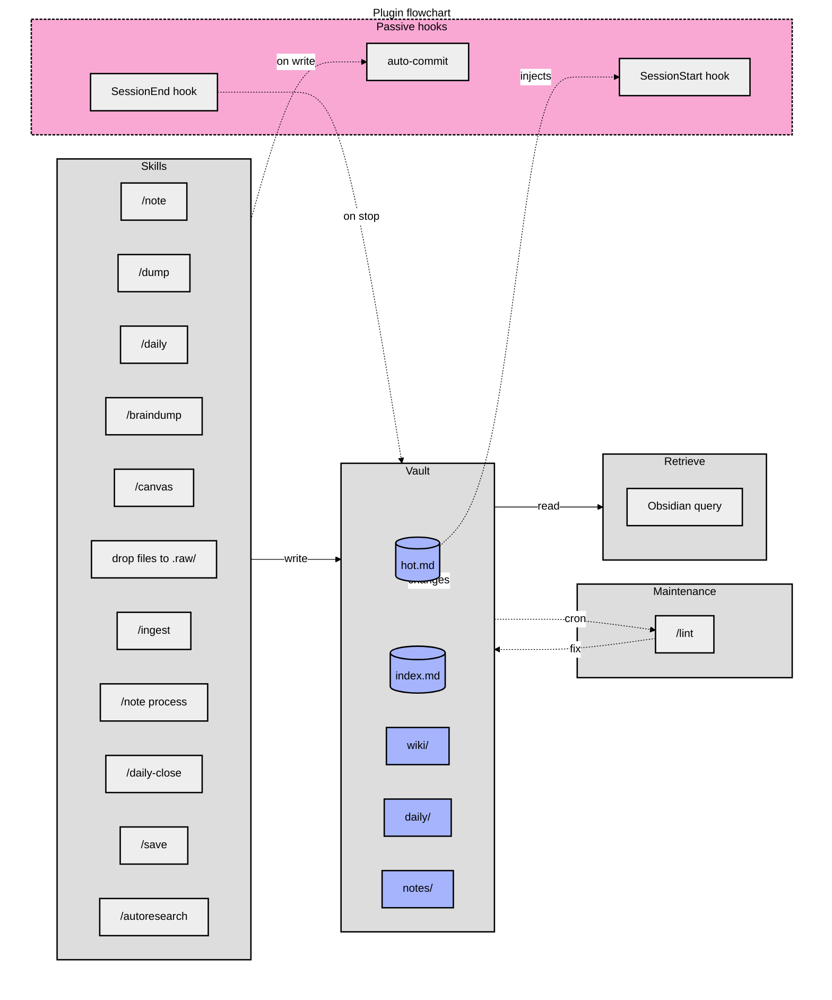

# agents-memo

Obsidian wiki plugin for AI coding agents — personal knowledge vault with LLM-assisted ingestion, research, and retrieval. Ships as a pi extension package with Claude Code compatibility.



**Legend**: phase orchestrators (medium gray subgraphs) wrap specialist skills (light gray). The wiki itself (indigo) is the compounding store every phase reads from or writes to. Passive hooks (dashed pink) run silently on session events.

## Install

**Prerequisites:** Obsidian 1.12.7+ with the CLI binary on your `PATH`.

### pi (recommended)

```bash
pi install npm:agents-memo
```

Configure vault path in `~/.pi/agent/settings.json`:

```json
{
  "agentsMemo": {
    "vaultPath": "/absolute/path/to/vault"
  }
}
```

Or set it in `.pi/settings.json` for per-project overrides.

### Claude Code

```bash
claude plugin marketplace add misiekhardcore/agents-memo
claude plugin install agents-memo@agents-memo
```

Set `vault_path` when Claude Code prompts for configuration.

### Vault registration

```bash
obsidian register vault=/absolute/path/to/vault
obsidian list vaults
```

See `_shared/setup.md` for troubleshooting and Flatpak setup.

## Skills

- `wiki` — bootstrap / health-check the vault
- `ingest` — parallel batch ingestion of sources
- `query` — answer questions from vault content
- `lint` — find orphan pages, dead links, stale claims
- `save` — save the current conversation or insight into the vault
- `notes` — quick inbox capture (`/note`, `/dump`); list and process flows for triage
- `daily` — append-only chronological log (`/daily`); timestamped bullets in `daily/YYYY-MM-DD.md`
- `daily-close` — end-of-day synthesis (`/daily-close`, "close today", "wrap up today"); appends a polished `## Summary` to today's daily file, idempotent on re-run
- `braindump` — split long-form text into atomic notes (`/braindump`, "brain dump this", "split this into notes"); each chunk filed via the full capture pipeline
- `autoresearch` — autonomous iterative research loop
- `canvas` — create / update Obsidian canvas files
- `defuddle` — strip clutter from web pages before ingestion
- `obsidian-markdown` — correct Obsidian-flavored Markdown (wikilinks, embeds, callouts)
- `obsidian-bases` — create / edit `.base` files

## Vault structure

```text
<vault_path>/
  wiki/          agent-generated knowledge (hot.md, index.md, concepts/, entities/, sources/)
  notes/         inbox: verbatim quick-capture notes (owned by `notes` skill)
  daily/         chronological daily log — one file per day (owned by `daily` skill)
  .raw/          immutable source documents + .manifest.json
  _templates/    Obsidian Templater templates
  _attachments/  images + PDFs referenced by wiki pages
  .obsidian/     (user-owned) Obsidian app config
```

## Runtime

The package runs as a **pi extension** (`extensions/`) and as **Claude Code hooks** (`hooks/`). Both backends share the same skills, agents, and vault scripts.

### pi extension

Registers lifecycle handlers for session events:

- **Session start / compact** — injects `_shared/INIT.md`, hot cache, index, and project memory digest
- **Tool call** — rewrites `obsidian` calls through `scripts/obsidian-cli.sh`, blocks direct vault I/O, guards daily overwrites
- **Tool execution end** — guards `wiki/hot.md` against 0-byte corruption
- **Agent settled** — auto-commits vault git changes
- **Agent end** — distills the run into project + global core learnings (reflection)
- **Session shutdown** — cross-project promotion sweep into `wiki/global-core.md`

Also registers the `memo_dispatch` tool for delegating work to vault sub-agents (single, parallel, chain modes).

### Claude Code hooks

Equivalent automations via `hooks/hooks.json`:

- **SessionStart** — hot cache + index injection
- **PostToolUse** — auto-commit vault changes on write
- **Stop** — hot cache nudge when vault was touched
- **SessionEnd** — end-of-session reflection

Hook logic in `hooks/*.sh`; `hooks.json` has thin invocations only.

## Scheduled Maintenance

Lint is **opt-in via OS scheduler** (cron, systemd timers, launchd). Use `bin/wiki-lint-cron.sh` to run the lint skill with auto-fix and commit.

**Example crontab (weekly, Sunday 03:00):**
```cron
0 3 * * 0 /absolute/path/to/agents-memo/bin/wiki-lint-cron.sh
```

**systemd user timer:**
Create `~/.config/systemd/user/wiki-lint.service` and `~/.config/systemd/user/wiki-lint.timer`, then `systemctl --user enable --now wiki-lint.timer`.

## Contributing

**Prerequisites:** Node.js ≥ 22 and npm.

```bash
npm install          # Install dependencies + husky pre-commit hook
npm run build        # Compile extensions (tsup)
npm run check        # Full validation: lint + format + typecheck + test
npm run fix          # Auto-fix lint and formatting
```

|Command|Purpose|
|-|-|
|`npm run build`|Compile TypeScript extensions to `dist/`|
|`npm run test`|Run smoke + regression tests|
|`npm run lint`|ESLint check|
|`npm run format`|Prettier check|
|`npm run typecheck`|TypeScript type-check|
|`npm run check`|All gates (lint + format + typecheck + test)|
|`npm run fix`|Auto-fix lint + format|

Pre-commit hook runs `lint-staged`: ESLint + Prettier on staged TS/JS/JSON, minify-md on staged MD.

## More

- Repository: <https://github.com/misiekhardcore/agents-memo>
- Agent-facing docs (skills, vault structure, ingest rules): [`AGENTS.md`](AGENTS.md)
